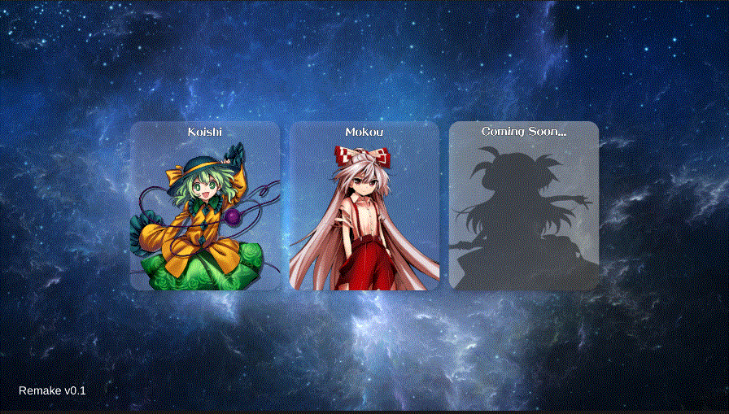
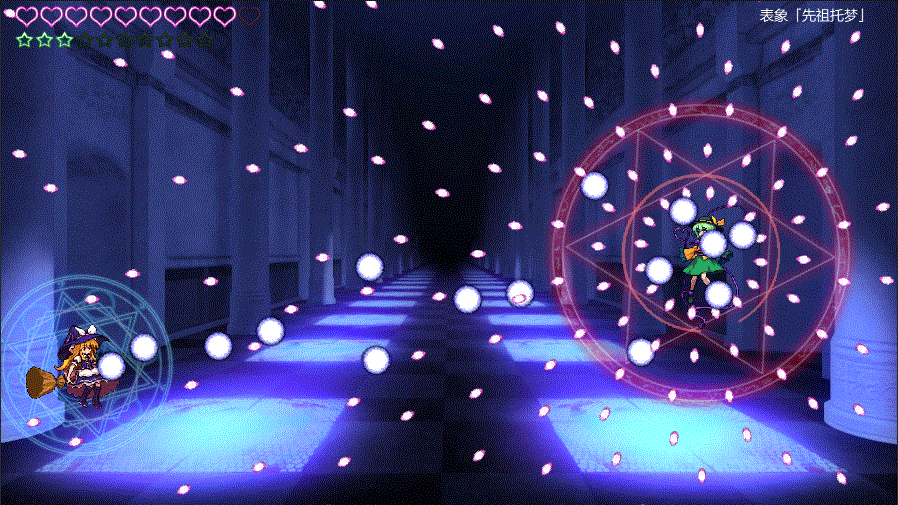

# Unity-TouhouSTG
[Chinese](README_zh.md)  
## Overview
A touhou-doujin horizontal scrolling shooting game。Made with Unity 2022.3.53 f1c1 and C#.  
Current version includes the listed features:  
* Scene switch and level selection
* Character control and enemy system
* Danmaku (or barrage) design based on ScriptableObject
* Use interface based on UGUI
* Audio system including SE and BGM 
* A basic dialogue system  
    

## Screenshots
  
  
  

## How to play
* In menu and level select scenes:  
    | Key | Function |
    | --- | --- |
    |  Z| Confirm |
    |  X| Cancel|
    |  Arrows| Move |

* In the gameplay scene:  
    | Key | Function |
    | --- | --- |
    |  Z| Shoot |
    |  X| Use bomb|
    |  Arrows| Move |
    |  LShift| Hold to enter low-speed mode |
    |  ESC| Back to main menu |

## Update description
This is the remake version of [my first Unity project](https://github.com/Ggross98/Unity-TouhouSTG-Old) which was developed in 2020 with Unity 2019. In this remake version, I optimized the game with new Unity features and added more diverse danmaku styles.  

## Copyrights
* Graphical assets of [東方憑依華](https://store.steampowered.com/app/716710/__Antinomy_of_Common_Flowers/) were used.
* Two fan music pieces: `彩音 ~xi-on~ - ラストリモート` and `豚乙女 - Shall we dance` were used.  
   
This project is for learning purposes only!
