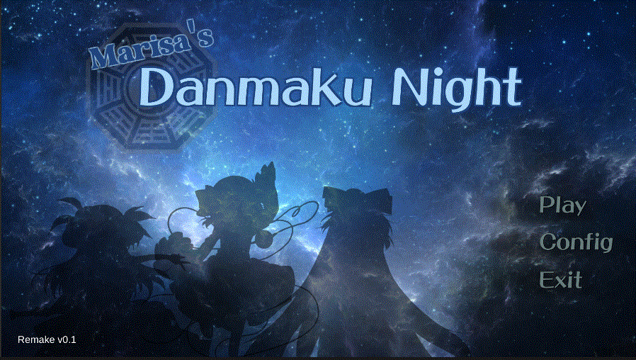
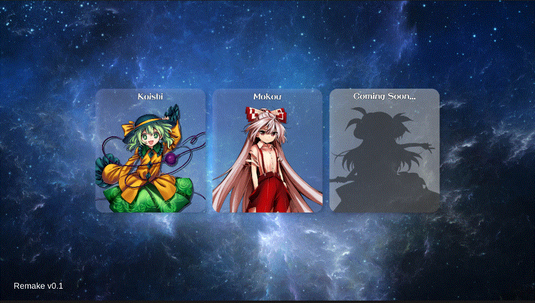
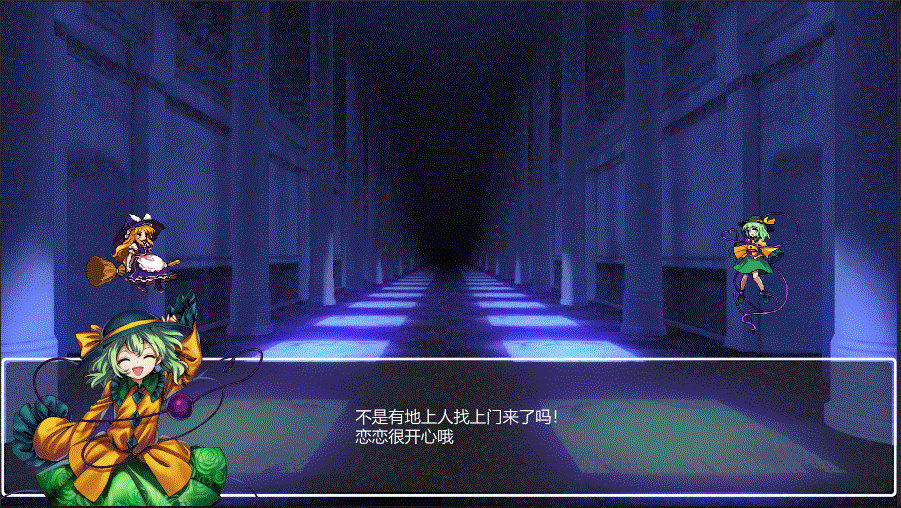
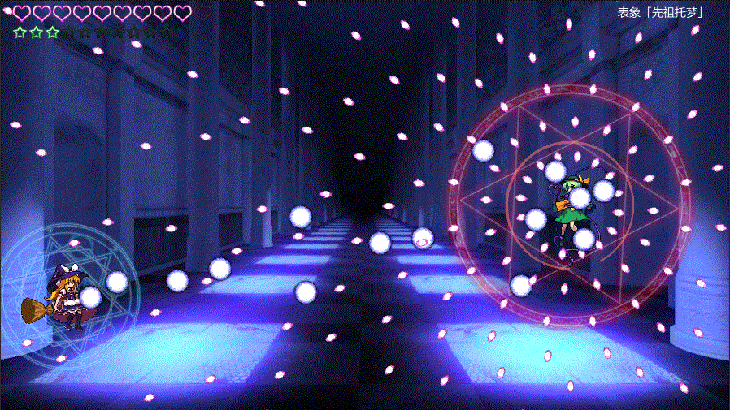

# Unity-TouhouSTG
[English](README.md)  
## 项目简介
东方同人横板射击游戏。使用Unity 2022.3.53 f1c1版本开发。当前版本包括以下主要内容：
* 场景切换及关卡选择系统
* 角色移动及射击控制系统
* 敌人的生成、行为逻辑和攻击
* 基于ScriptableObject的多样弹幕设计
* 基于UGUI的GUI系统
* 音乐和音效系统
* 基本的对话系统  
    

## 游戏截图
  
  
  

## 安装及游玩
### 安装
- 下载游戏：已上传Release
- 打开源文件：下载TouhouSTG文件夹，用Unity打开

### 游戏操作
* 菜单界面  
    | 按键 | 功能 |
    | --- | --- |
    |  Z| 确认 |
    |  X|  取消|
    |  方向键| 移动 |

* 游戏界面  
    | 按键 | 功能 |
    | --- | --- |
    |  Z| 射击 |
    |  X| 使用Bomb|
    |  方向键| 移动 |
    |  LShift| 按住进入低速模式 |
    |  ESC| 返回主菜单 |

## 更新说明
这是我[第一个Unity项目](https://github.com/Ggross98/Unity-TouhouSTG-Old)（初建于2020年，使用Unity 2019版本开发）的重制版。使用了新版Unity的UGUI及ObjectPool等特性，对游戏结构进行了优化，并设计了更丰富的弹幕类型。  
由于时间问题，本项目可能短期内不再更新。

## 版权声明
* 使用了东方凭依华的游戏素材
* 使用了两手东方同人音乐：`彩音 ~xi-on~ - ラストリモート`及`豚乙女 - Shall we dance`  
* 
本项目仅供学习使用，不可用于任何其他用途